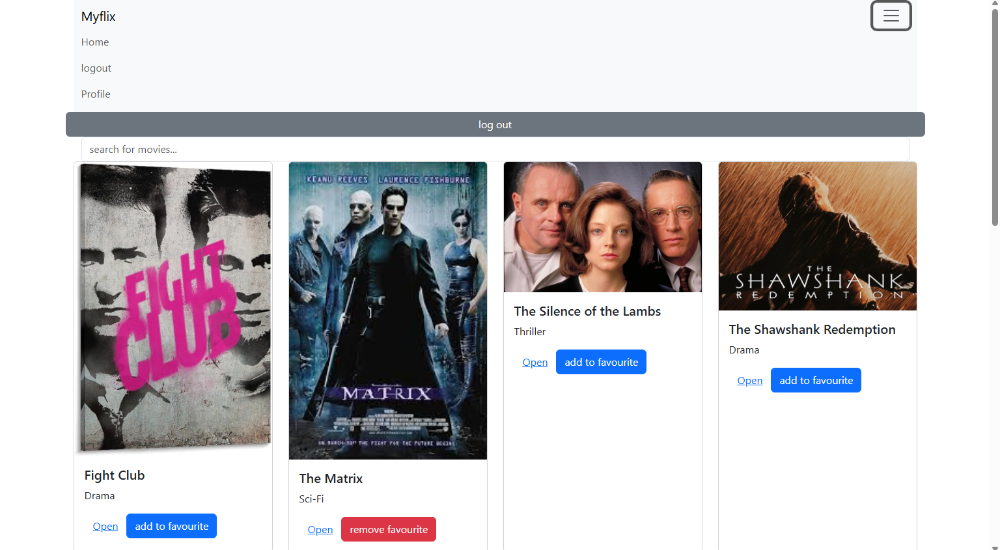
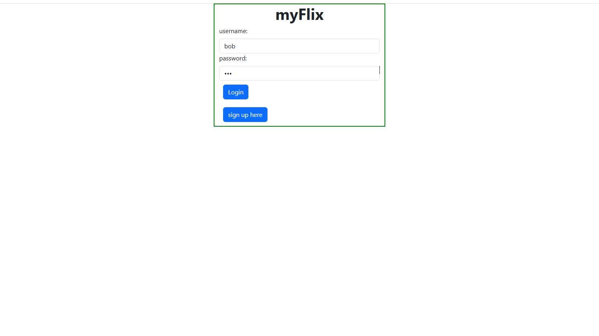
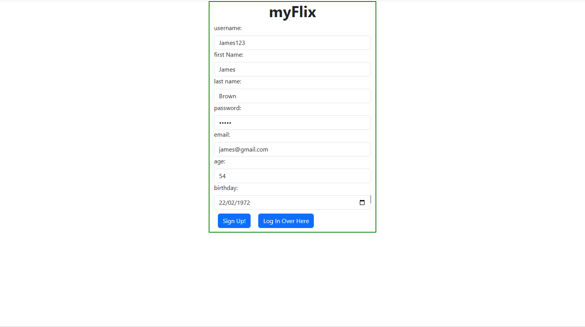
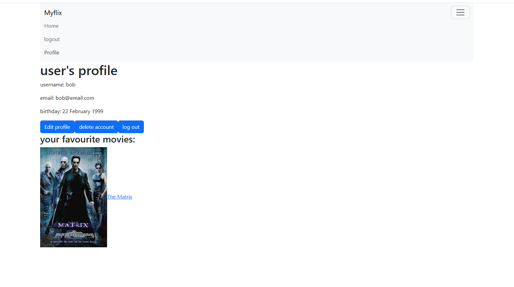

# MyFlix Client Application

A React-based movie browsing application that allows users to explore movies, manage favorites, and maintain their profiles.

##  [Live Demo](https://voluble-elf-1a3488.netlify.app/)

---

##  Table of Contents

- [Overview](#overview)
- [Screenshots](#screenshots)
- [Features](#features)
- [Technical Stack](#technical-stack)
- [Redux Architecture](#redux-architecture)
- [Component Structure](#component-structure)
- [API Integration](#api-integration)
- [Setup Instructions](#setup-instructions)
- [API Access](#api-access)
- [Prerequisites](#prerequisites)
- [Contributing](#contributing)
- [License](#license)

---

## Overview

MyFlix is a client-side application for browsing movies, built with React and styled with Bootstrap. This **single-page application** provides a responsive, user-friendly interface that interacts with a separate backend **RESTful API** (Node.js/Express) to manage data and user authentication.

The application demonstrates modern web development practices including Redux state management, React Router navigation, and JWT-based authentication.

---

## Screenshots

### Home Page

*Main movie browsing interface showing the movie collection*

### Login Page

*User authentication interface*

### Sign Up Page

*New user registration form*

### Profile Page

*User profile management and favorite movies*

---

## Features

**Movie Browsing:**

* Displays a list of movies, fetched from the backend API.
* Each movie is presented as a "MovieCard" with key details.

**Movie Details:**

* Provides a dedicated "MovieView" page accessible via a link from the "MovieCard".
* Displays comprehensive information about a selected movie.

**User Authentication:**

* **Login:** Existing users can log in using their username and password.
    * Upon successful login, the application receives a JWT token from the backend, which is stored in local storage for subsequent authenticated requests.
* **Sign Up:** New users can register by providing a username, password, email, and date of birth.
* **Logout:** Users can log out, which clears their authentication token from local storage.

**User Profile:**

* Users can access their profile page ("ProfileView").
* Displays user information.
* Allows users to update their information (username, password, email, date of birth).

**Favorite Movies:**

* Users can add movies to their list of favorites.
* Users can remove movies from their list of favorites.
* The favorite movies list is persisted via the backend API.

**Search:**

* Users can search for movies by title.

---

## Technical Stack

- **Frontend Framework:** React.js
- **State Management:** Redux Toolkit
- **Routing:** React Router
- **UI Framework:** React Bootstrap
- **Build Tool:** Parcel
- **Authentication:** JWT tokens
- **HTTP Client:** Fetch API

---

## Redux Architecture

The application uses Redux for state management. Here's a breakdown:

* **Store:** The Redux store is configured in `redux/store.js`.
* **Reducers and Actions:** Movie data is managed by a reducer and actions defined in `redux/moviesSlice.js`. This uses Redux Toolkit's `createSlice` for efficient reducer and action creation.
* **Component Connection:** Components like `MainView` use `useDispatch` to dispatch actions (e.g., fetching movie data) and `useSelector` to access data from the Redux store.

This architecture ensures a centralized and predictable way to manage the application's data.

---

## Component Structure

* **MainView:** The main component that orchestrates the application, handling routing, state management, and rendering of different views.
* **MovieCard:** Displays a single movie's information in a card format.
* **MovieView:** Displays detailed information about a selected movie.
* **LoginView:** Handles user login.
* **SignupView:** Handles user registration.
* **NavigationBar:** Displays the navigation bar.
* **ProfileView:** Displays and manages the user's profile.
* **MovieSearch:** Handles the movie search functionality.

---

## API Integration

This client-side application relies on a separate backend API to provide the following functionalities:

* `GET /movies`: Retrieves a list of all movies.
* `GET /movies/:id`: Retrieves a specific movie by ID.
* `POST /users`: Registers a new user.
* `POST /login`: Authenticates a user and returns a JWT token.
* `GET /users/:username`: Retrieves a user's information.
* `PUT /users/:username`: Updates a user's information.
* `PUT /users/:username/movies/:movieId`: Adds a movie to a user's list of favorite movies.
* `DELETE /users/:username/movies/:movieId`: Removes a movie from a user's list of favorite movies.

---

## Setup Instructions

### 1. Clone the Repository
```bash
git clone https://github.com/dwyertyrell/myFlix-client.git
cd myFlix-client
```

### 2. Install Dependencies
```bash
npm install
```

### 3. Start Development Server
```bash
npm start
```

The application will be accessible at `http://localhost:1234` (or the port specified by Parcel).

---

## API Access
This project uses environement variables stored on the Vercel hosting server, to access the API, for security purposes.  

### For Contributors
- The API URL is configured via environment variables in Vercel

---

## Prerequisites

* **Backend API:** This application requires a running instance of the MyFlix backend API. Ensure that the API is set up and accessible before running the client.
* **Node.js and npm:** Node.js and npm (Node Package Manager) are required to install dependencies and run the application.

---

## Contributing

1. Fork the repository
2. Create your feature branch (`git checkout -b feature/amazing-feature`)
3. make sure `.env` file is configured with the default (or your desired) API endpoint
4. Install dependencies (`npm install`)
5. Make your changes
6. Commit your changes (`git commit -m 'Add some amazing feature'`)
7. Push to the branch (`git push origin feature/amazing-feature`)
8. Open a Pull Request

---

## License

This project is open source and available under the [MIT License](LICENSE).

---

## Author

**Tyrell Dwyer** - [GitHub Profile](https://github.com/dwyertyrell)

---

### Important Notes

- **Authentication:** JWT tokens are stored in local storage for session management
- **Error Handling:** The application includes comprehensive error handling for API requests
- **Responsive Design:** Built with Bootstrap for mobile-friendly responsive layout
- **Security:** Environment variables are used for sensitive configuration data